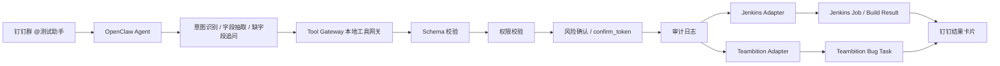

下面给你一版更完整、可落地、适合当前项目现状的方案。核心判断仍然是：OpenClaw 负责理解自然语言和对话补全，本地 Tool Gateway 负责可信执行、权限、确认、审计、外部系统调用。不要让模型直接拼 Jenkins URL、Teambition 请求或自然语言命令。

## 一、项目定位

项目名称建议保持为：基于 OpenClaw 的 CI 流水线触发与缺陷助手。

目标是做一个钉钉测试助手机器人，测试人员在钉钉群里通过自然语言完成两类高频操作：触发 Jenkins 已配置好的自动化测试任务，以及创建 Teambition 缺陷单。系统必须支持缺字段追问、权限校验、执行前确认、结果回传和日志审计。

这不是一个“让 AI 直接操作系统”的项目，而是一个 ChatOps + 受控工具网关项目。AI 只负责把人话变成结构化意图；真正执行动作的代码必须是确定性的、可审计的、可配置的。

## 二、推荐总体架构



当前仓库已经有类似雏形：`scripts/ci_executor.py` 相当于本地执行器，`app/tools/jenkins_tool.py` 是 Jenkins Adapter，`app/tools/teambition_tool.py` 是 Teambition Adapter，`app/auth.py` 做了基础角色权限，`docs/openclaw-tool-router-prompt.md` 是 OpenClaw 路由提示词。因此完善方案不建议推倒重来，而是把现有雏形升级为更规范的 Tool Gateway。

## 三、职责边界

OpenClaw 的职责是：识别用户意图，判断是触发 Jenkins、创建 bug、查询构建结果还是查询缺陷；从自然语言中提取字段；发现缺字段时继续追问；把用户确认动作转成结构化 JSON；把 Tool Gateway 的结构化结果转成钉钉可读回复。

Tool Gateway 的职责是：只接受固定 JSON schema；只允许固定 action 枚举；校验参数合法性；根据钉钉真实 `user_id` 查权限；对高风险动作生成确认 token；确认通过后调用 Jenkins 或 Teambition；记录审计日志；返回稳定、可机器解析的结果。

Jenkins Adapter 的职责是：把项目内 job alias 映射到真实 Jenkins job path；校验环境、分支、必填参数；调用 Jenkins `buildWithParameters`；读取 queue item；轮询 build result；返回构建编号、状态、耗时、链接和摘要。

Teambition Adapter 的职责是：把标准缺陷字段映射为 Teambition API 字段；使用配置中的项目、任务流、阶段、缺陷类型、自定义字段 ID；创建缺陷；返回 task id 和链接。

## 四、统一 Action 设计

建议保留当前代码已有的点号风格 action，避免大改：

```text
jenkins.trigger
jenkins.query
bug.create
bug.query
```

不要同时存在 `trigger_jenkins` 和 `jenkins.trigger` 两套命名。当前 `app/schemas.py` 只支持 `jenkins.trigger` 和 `bug.create`，所以短期内建议先扩展为：

```python
Literal["jenkins.trigger", "jenkins.query", "bug.create", "bug.query"]
```

如果坚持使用方案里的 `trigger_jenkins`、`create_bug` 风格，也可以，但需要统一修改 OpenClaw 提示词、schema、执行器和测试用例。我的建议是不要改风格，直接在现有基础上扩展。

## 五、标准请求格式

所有 OpenClaw 到 Tool Gateway 的请求都应是 JSON，不允许传自然语言命令。

### 1. Jenkins 触发请求

```json
{
  "request_id": "ci_20260607_001",
  "conversation_id": "dingtalk_group_xxx",
  "user_id": "dingtalk_user_123",
  "action": "jenkins.trigger",
  "job": "api-auto-test",
  "params": {
    "env": "test",
    "branch": "develop"
  },
  "confirmed": false,
  "confirm_token": null,
  "wait_result": true
}
```

其中 `user_id` 必须来自钉钉回调里的真实发送人，不允许由模型根据文本猜。`job` 必须是配置中的 job alias，不允许直接传真实 Jenkins job path。`params` 只能包含该 job 配置允许的参数。

### 2. Jenkins 确认请求

当首次触发需要确认时，Tool Gateway 返回：

```json
{
  "success": false,
  "code": "needs_confirmation",
  "request_id": "ci_20260607_001",
  "conversation_id": "dingtalk_group_xxx",
  "message": "将触发 Jenkins 任务 api-auto-test，环境 test，分支 develop。是否确认？",
  "confirm_token": "confirm_xxx",
  "expires_in_seconds": 300,
  "preview": {
    "action": "jenkins.trigger",
    "job": "api-auto-test",
    "params": {
      "env": "test",
      "branch": "develop"
    }
  }
}
```

用户回复“确认”后，OpenClaw 再调用：

```json
{
  "request_id": "ci_20260607_001_confirm",
  "conversation_id": "dingtalk_group_xxx",
  "user_id": "dingtalk_user_123",
  "action": "jenkins.trigger",
  "job": "api-auto-test",
  "params": {
    "env": "test",
    "branch": "develop"
  },
  "confirmed": true,
  "confirm_token": "confirm_xxx",
  "wait_result": true
}
```

确认 token 必须绑定原始请求内容、用户、会话和过期时间。不能只靠 `confirmed=true`，否则存在误触发和重放风险。

### 3. Jenkins 执行结果

```json
{
  "success": true,
  "code": "build_success",
  "request_id": "ci_20260607_001",
  "conversation_id": "dingtalk_group_xxx",
  "job": "api-auto-test",
  "build_number": 128,
  "build_status": "SUCCESS",
  "duration_seconds": 86,
  "build_url": "http://jenkins8090.yaozh.com:8090/job/openclaw-ci-test/128/",
  "summary": "total=36 passed=36 failed=0"
}
```

如果失败，应返回 `build_failed` 或 `build_finished`，并带上失败摘要、失败用例数量、报告链接。MVP 可以先只返回 Jenkins 状态和链接，后续再解析测试报告。

## 六、Bug 创建请求格式

OpenClaw 应优先输出结构化字段，Tool Gateway 做字段校验和默认值补充。

```json
{
  "request_id": "bug_20260607_001",
  "conversation_id": "dingtalk_group_xxx",
  "user_id": "dingtalk_user_123",
  "action": "bug.create",
  "params": {
    "title": "登录接口500",
    "env": "test",
    "module": "登录",
    "api": "/api/login",
    "severity": "P2",
    "steps": "输入正确账号后提交",
    "actual": "接口返回500",
    "expected": "登录成功或返回明确错误",
    "assignee": "default"
  },
  "source": {
    "platform": "dingtalk",
    "conversation_id": "dingtalk_group_xxx",
    "reporter_user_id": "dingtalk_user_123"
  }
}
```

建议 bug 的业务必填字段为：

```text
title, env, module, severity, steps, expected, actual
```

`project_id`、`tasklist_id`、`stage_id`、`scenariofieldconfigId`、自定义字段 ID 不应该让用户填写，应来自配置。`executor_id` 可以来自配置默认值，也可以通过钉钉用户映射或用户自然语言指定，但最终必须由 Tool Gateway 从白名单/配置中解析，不能让模型随便生成 Teambition user id。

如果缺字段，返回：

```json
{
  "success": false,
  "code": "missing_fields",
  "request_id": "bug_20260607_001",
  "conversation_id": "dingtalk_group_xxx",
  "missing_fields": ["expected", "actual"],
  "message": "还缺少：预期结果、实际结果。请补充后我继续创建。",
  "extracted": {
    "title": "登录接口500",
    "env": "test",
    "api": "/api/login",
    "steps": "输入正确账号后提交"
  }
}
```

OpenClaw 看到 `missing_fields` 后，只负责追问缺失字段。用户补充后继续用同一个 `conversation_id` 调用 `bug.create`，Tool Gateway 合并上下文。当前 `app/session_store.py` 已经有类似能力，可以继续沿用。

## 七、Teambition 字段映射

Teambition Adapter 应该把标准字段转换成 Teambition 创建任务请求。建议目标结构为：

```json
{
  "projectId": "tb_project_id",
  "content": "登录接口500",
  "executorId": "tb_executor_id",
  "stageId": "tb_stage_id",
  "tasklistId": "tb_tasklist_id",
  "scenariofieldconfigId": "tb_bug_sfc_id",
  "priority": "2",
  "visible": "members",
  "note": "环境：test\n模块：登录\n接口：/api/login\n复现步骤：输入正确账号后提交\n实际结果：接口返回500\n预期结果：登录成功或返回明确错误\n来源：钉钉群 dingtalk_group_xxx\n报告人：dingtalk_user_123",
  "customfields": [
    {
      "cfId": "cf_env",
      "customfieldName": "环境",
      "value": [{ "title": "test" }]
    },
    {
      "cfId": "cf_api",
      "customfieldName": "接口",
      "value": [{ "title": "/api/login" }]
    },
    {
      "cfId": "cf_severity",
      "customfieldName": "严重程度",
      "value": [{ "title": "P2" }]
    }
  ]
}
```

当前 `teambition_tool.py` 已经能调用 `/v3/task/create`，但还不够完整。建议后续增强 customfields、执行人映射、缺陷类型配置、错误码处理和创建后链接生成。

## 八、配置设计

建议从当前 `configs/jobs.yaml`、`configs/users.yaml` 扩展为三类配置：用户权限、Jenkins job 白名单、Teambition 映射。

```yaml
users:
  dingtalk_user_123:
    name: "张三"
    roles: ["tester"]
    allowed_jobs: ["api-auto-test", "ui-smoke-test"]
    can_create_bug: true
    teambition_operator_id: "tb_user_123"

  dingtalk_user_456:
    name: "李四"
    roles: ["developer"]
    allowed_jobs: ["api-auto-test"]
    can_create_bug: true
    teambition_operator_id: "tb_user_456"

jenkins_jobs:
  api-auto-test:
    jenkins_name: "openclaw-ci-test"
    description: "接口自动化测试"
    require_confirm: true
    allowed_roles: ["tester", "admin"]
    params:
      env:
        required: true
        allowed: ["test", "stage"]
      branch:
        required: true
        default: "develop"
        pattern: "^[a-zA-Z0-9._/-]+$"

  ui-smoke-test:
    jenkins_name: "ui-smoke-test"
    description: "UI 冒烟测试"
    require_confirm: true
    allowed_roles: ["tester", "admin"]
    params:
      env:
        required: true
        allowed: ["test", "stage"]

teambition:
  project_id: "tb_project_id"
  bug_sfc_id: "tb_bug_sfc_id"
  default_stage_id: "tb_stage_id"
  default_tasklist_id: "tb_tasklist_id"
  default_executor_id: "tb_user_default"
  priority_map:
    P0: 10
    P1: 0
    P2: -10
    P3: -20
  customfields:
    env: "cf_env"
    api: "cf_api"
    severity: "cf_severity"
    module: "cf_module"
```

注意：真实 token、app secret、Jenkins token、OpenClaw API key 不应该放到 `target.txt` 或 README 中，应该放到 `.env`、部署环境变量或密钥管理服务。`target.txt` 里已有疑似密钥，建议立即轮换。

## 九、权限与安全机制

权限必须在 Tool Gateway 做，不能只依赖 OpenClaw 提示词。建议规则如下：

Jenkins 触发必须满足：用户存在；用户角色允许；job 在白名单中；job 参数合法；环境在允许范围内；高风险 job 已确认；confirm token 未过期且与原始请求匹配。

Teambition 创建必须满足：用户存在；用户有创建缺陷权限；项目 ID、任务列表 ID、阶段 ID、字段 ID 均来自配置；缺陷字段完整；请求内容长度合理；不能把任意用户输入直接拼成 API 字段 ID。

审计日志必须记录：`request_id`、时间、`conversation_id`、`user_id`、action、参数摘要、权限判断、确认状态、外部 API 结果、错误码、外部链接。日志中不要记录 token、secret、完整认证头。

## 十、OpenClaw 提示词规则

OpenClaw 的工具路由提示词建议明确写成：

当用户表达“跑一下、执行、触发、构建、流水线、自动化、Jenkins、CI、冒烟、接口测试”等意图时，调用 `jenkins.trigger`。

当用户表达“创建 bug、提缺陷、记录问题、提交问题单、Teambition”等意图时，调用 `bug.create`。

OpenClaw 不要说“我没有 Jenkins/Teambition 权限”，也不要问“你用哪个缺陷系统”。本项目默认 Jenkins 和 Teambition 已由本地工具配置。

OpenClaw 不要猜 job path、projectId、tasklistId、customfieldId、executorId。它只能输出业务字段，系统 ID 由 Tool Gateway 配置映射。

如果 Tool Gateway 返回 `missing_fields`，OpenClaw 只追问缺失项，不重复询问已抽取字段。

如果 Tool Gateway 返回 `needs_confirmation`，OpenClaw 必须把确认文案发给用户，并等待用户明确确认后再传 `confirm_token`。

如果用户只说“确认”，OpenClaw 必须使用同一个 `conversation_id` 找到上一条待确认请求，不得创建新请求。

## 十一、当前代码需要优先修改的点

第一，修复 `scripts/call_ci_assistant.py` 的路由。目前 `_action()` 最后总是返回 `bug.create`，这会导致 Jenkins 请求被错误当成 bug 创建。应改成根据关键词返回 `jenkins.trigger` 或 `bug.create`，无法判断时返回 `unknown_intent` 或让 OpenClaw 追问。

第二，扩展 `app/schemas.py`，支持 `jenkins.query`、`bug.query`、`confirm_token`、`source`、`build_number`、`duration_seconds`、`summary` 等字段。

第三，新增确认 token 存储，例如 `runtime/confirmations/{token}.json`，保存原始请求哈希、用户、会话、过期时间和状态。确认成功后 token 立即作废。

第四，完善 Jenkins 配置结构。当前 `configs/jobs.yaml` 只有 `ci_test`，需要增加真实 job alias，比如 `api-auto-test`，并支持参数 allowed/default/pattern。

第五，完善 Teambition 配置结构。当前 `.env` 里保存 project/tasklist/stage/sfc 等基础字段，但建议迁移到 YAML 配置，并增加 customfields、priority_map、default_executor_id。

第六，补审计日志模块，例如 `runtime/audit/YYYY-MM-DD.jsonl`，每次请求一行 JSON，方便排障和复盘。

第七，补单元测试或 mock 测试。至少覆盖：无权限触发 Jenkins、未知 job、非法 env、缺少 branch、需要确认、确认 token 过期、bug 缺字段、多轮补字段、Teambition mock 创建成功。

## 十二、落地路线

第一阶段做 MVP，把当前代码修到可演示。重点是修复 Jenkins/bug 路由，统一 action schema，配置一个真实 Jenkins job alias，保留 mock 模式，跑通“钉钉自然语言 → OpenClaw → 本地执行器 → 返回 JSON → 钉钉回复”。这一阶段目标是能稳定演示触发 Jenkins 和创建 mock bug。

第二阶段接真实系统。配置 Jenkins token、Teambition app 信息、项目/任务列表/阶段/缺陷类型 ID。Jenkins 使用真实 `buildWithParameters`，Teambition 使用真实 `/v3/task/create`。这一阶段要注意不要把密钥写进文档或仓库。

第三阶段补安全闭环。实现 confirm token、防重放、审计日志、用户权限配置、参数白名单、错误码标准化。这个阶段完成后，才适合在真实测试群里小范围试用。

第四阶段优化体验。做钉钉卡片，展示任务名、环境、分支、状态、耗时、Jenkins 链接、失败摘要；Teambition 创建后展示缺陷标题、优先级、执行人、链接。增加 `jenkins.query` 和 `bug.query`，支持用户问“刚才那个跑完了吗”“刚才创建的 bug 链接发我一下”。

第五阶段增强智能能力。让 OpenClaw 支持更多自然语言表达、自动补默认分支、根据“接口自动化/冒烟/UI”映射 job alias、根据用户所在群默认项目、根据缺陷内容建议 severity。但这些增强都只能发生在结构化字段层面，不能绕过 Tool Gateway 的校验。

## 十三、最终推荐版数据流

用户说：

```text
@测试助手 帮我跑一下药智数据接口自动化，环境 test，分支 develop
```

OpenClaw 输出：

```json
{
  "request_id": "ci_20260607_001",
  "conversation_id": "dingtalk_group_xxx",
  "user_id": "dingtalk_user_123",
  "action": "jenkins.trigger",
  "job": "api-auto-test",
  "params": {
    "env": "test",
    "branch": "develop"
  },
  "confirmed": false,
  "wait_result": true
}
```

Tool Gateway 返回确认：

```json
{
  "success": false,
  "code": "needs_confirmation",
  "message": "将触发 Jenkins 任务：接口自动化测试，环境：test，分支：develop。请回复“确认”继续。",
  "confirm_token": "confirm_xxx",
  "expires_in_seconds": 300
}
```

用户说：

```text
确认
```

OpenClaw 再调用确认请求。Tool Gateway 校验 token 后触发 Jenkins，并返回：

```json
{
  "success": true,
  "code": "build_success",
  "job": "api-auto-test",
  "build_number": 128,
  "build_status": "SUCCESS",
  "duration_seconds": 86,
  "build_url": "http://jenkins8090.yaozh.com:8090/job/openclaw-ci-test/128/",
  "summary": "接口自动化执行完成，36 条通过，0 条失败。"
}
```

钉钉回复：

```text
接口自动化执行完成：SUCCESS
任务：api-auto-test #128
环境：test
分支：develop
耗时：86 秒
结果：36 条通过，0 条失败
链接：http://jenkins8090.yaozh.com:8090/job/openclaw-ci-test/128/
```

## 十四、结论

完善后的方案是可行的，并且适合你当前项目。最推荐的架构是“OpenClaw Agent + 本地 Tool Gateway + Jenkins Adapter + Teambition Adapter”。当前仓库已经具备基础执行器、Jenkins 工具、Teambition 工具、权限配置和多轮补字段能力，不需要重做；重点是把它从“脚本雏形”升级为“受控工具网关”。

最优先要做的不是继续优化提示词，而是先修复本地执行链路：统一 action，修复 Jenkins 路由，增加 confirm token，完善配置和审计。这样 OpenClaw 的自然语言能力才能安全地接到真实 Jenkins 和 Teambition 上。

Sources:

- [target.txt](computer://C%3A%5C2_PROJECT%5Cproj%5Copenclaw-ci-defect-assistant%5Ctarget.txt)
- [README.md](computer://C%3A%5C2_PROJECT%5Cproj%5Copenclaw-ci-defect-assistant%5CREADME.md)
- [openclaw-tool-router-prompt.md](computer://C%3A%5C2_PROJECT%5Cproj%5Copenclaw-ci-defect-assistant%5Cdocs%5Copenclaw-tool-router-prompt.md)
- [app/schemas.py](computer://C%3A%5C2_PROJECT%5Cproj%5Copenclaw-ci-defect-assistant%5Capp%5Cschemas.py)
- [scripts/ci_executor.py](computer://C%3A%5C2_PROJECT%5Cproj%5Copenclaw-ci-defect-assistant%5Cscripts%5Cci_executor.py)
- [scripts/call_ci_assistant.py](computer://C%3A%5C2_PROJECT%5Cproj%5Copenclaw-ci-defect-assistant%5Cscripts%5Ccall_ci_assistant.py)
- [app/tools/jenkins_tool.py](computer://C%3A%5C2_PROJECT%5Cproj%5Copenclaw-ci-defect-assistant%5Capp%5Ctools%5Cjenkins_tool.py)
- [app/tools/teambition_tool.py](computer://C%3A%5C2_PROJECT%5Cproj%5Copenclaw-ci-defect-assistant%5Capp%5Ctools%5Cteambition_tool.py)